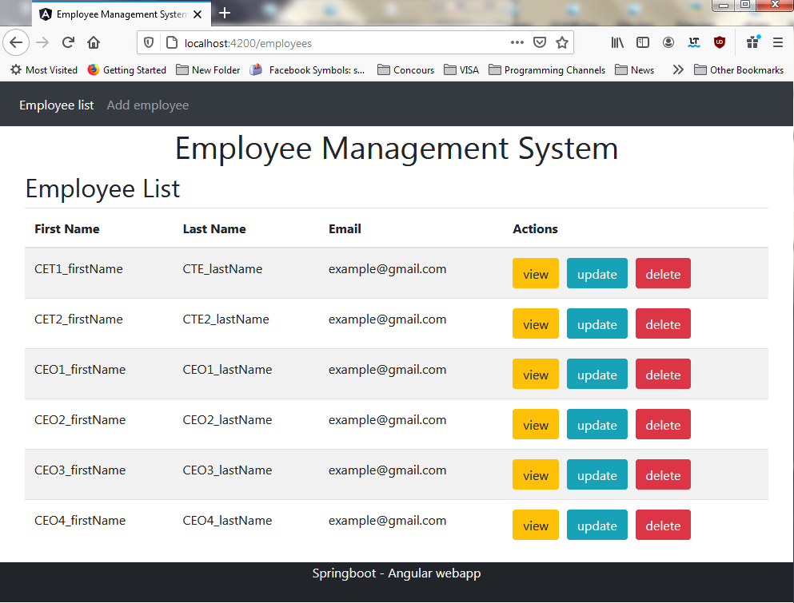
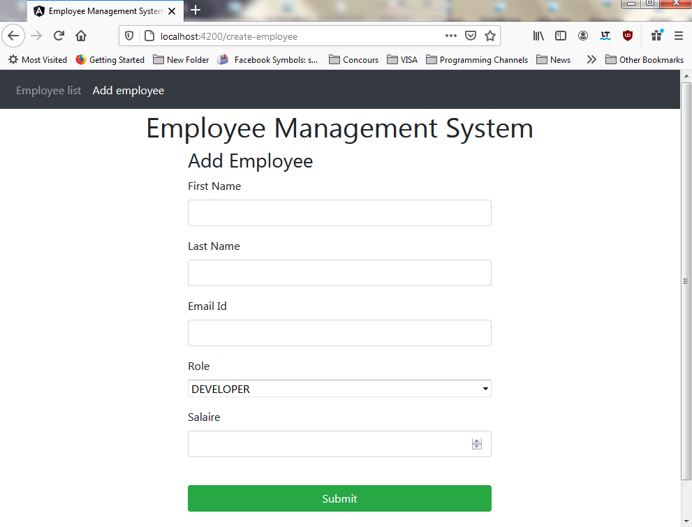

# Employee Management System
 
| Projet JavaEE |
| ------ |
| Auto-Formation |
| Projet `EmployeeManagementSystem` (v.0.0.1) |
***********************************************************************
## Features
The app helps you manage users, built by Spring Boot for the backend and Angular(TypeScript) for the frontend.

This project was generated with [Angular CLI](https://github.com/angular/angular-cli) version 10.1.7.

> Note: To use the backend side, please check it on the URL below :
https://github.com/Ayoub-BL/EmployeeManagementSystem_Backend_SpringBoot

### Screenshots :

#### List of Employees

#### Add Employee

## Tech
- Angular
- SpringBoot
- Spring JPA (Hibernate)
- Base de données MySQL
- HTML
- ✨Bootstrap✨

## Database configuration
Run phpMyAdmin and open the application with Elipse IDE and run it
💡 `You don't need to create a database, it will be created automatically 😉`

## Development server

Run `ng serve` for a dev server. Navigate to `http://localhost:4200/`. The app will automatically reload if you change any of the source files.

## Code scaffolding

Run `ng generate component component-name` to generate a new component. You can also use `ng generate directive|pipe|service|class|guard|interface|enum|module`.

## Build

Run `ng build` to build the project. The build artifacts will be stored in the `dist/` directory. Use the `--prod` flag for a production build.

## Running unit tests

Run `ng test` to execute the unit tests via [Karma](https://karma-runner.github.io).

## Running end-to-end tests

Run `ng e2e` to execute the end-to-end tests via [Protractor](http://www.protractortest.org/).

## Further help

To get more help on the Angular CLI use `ng help` or go check out the [Angular CLI README](https://github.com/angular/angular-cli/blob/master/README.md).

## Contact
> `boulahya.ayoub@gmail.com`
 
> `ayoub.boulahya@etu.univ-amu.fr`

## License
**Free Software, Hell Yeah!**
